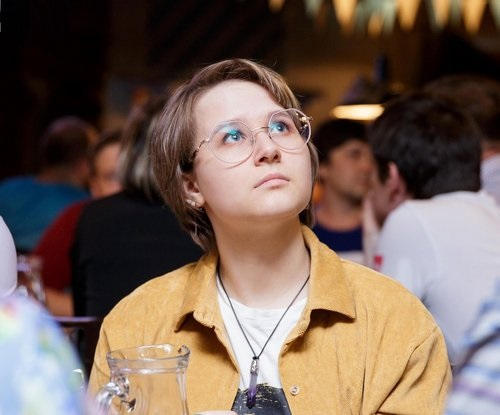

### Hi there 👋
## My name is Nadya I have 1 year 7 months experience in backend development, 11 months in Web-development and 1 year 6 months experiens with folowwing stack: JSON, HTML, CSS, REST, SQL, REACT, Redux. Right now I am trying myself in frontend!✨



#### Here are some things to get to know:
- 🌱 I’m currently learning frontend development, mostly on React with styled-components
- 🤔 I’m looking for help with finding my first frontend job or internship
- 💬 Ask me about TS, JS, ReactJS, HTML, CSS, styled-components, Antd, Angular, Vue
- 📫 How to reach me: https://t.me/violets_are_blur
- ⚡ Nice fact: Bunnies can be veeery cute :З
```
  ====================
| That's actually true |
  ====================
     (\__/) ||
     (•ㅅ•) ||
     /   づ
```
##### Expierenced in:
* React.js
* CSS
* HTML
* SASS
* Angular
* Vue.js
* JavaScript
* TypeScript
* Ruby
* Python
* Node.js


<!--
**NadyaSukhova/NadyaSukhova** is a ✨ _special_ ✨ repository because its `README.md` (this file) appears on your GitHub profile.

Here are some ideas to get you started:

- 🔭 I’m currently working on ...
- 🌱 I’m currently learning ...
- 👯 I’m looking to collaborate on ...
- 🤔 I’m looking for help with ...
- 💬 Ask me about ...
- 📫 How to reach me: ...
- 😄 Pronouns: ...
- ⚡ Fun fact: ...
-->
